## ENTORNOS DE DESARROLLO - 1 DAW
## Daniel Sobrino Ollé
# PRÁCTICA 4

### Primeros pasos
Para esta práctica empezaré por crear el repositorio mediante la interfaz gráfica que nos ofrece github. Para poder acceder y modificar el repositorio he tenido que crear un token, para posteriormente autentificarme con este.
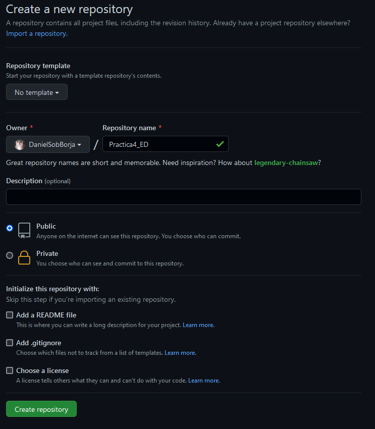

Primero creo un archivo ```.gitignore``` para evitar que controle el estado de archivos o directorios indeseados. Una vez creado este, ejecuto ```git init``` para inicializar el repositorio en local, y añado los directorios a la "vigilancia".


Una vez añadidos, puedo hacer un commit de todos estos archivos y directorios.
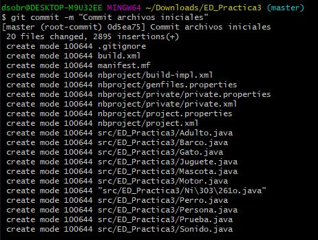

### Subiendo a Github
Decido crear ahora el ```README.md``` mediante la terminal y le hago commit. A continuación enlazo mi directorio local con el repositorio de github y subo los commits.
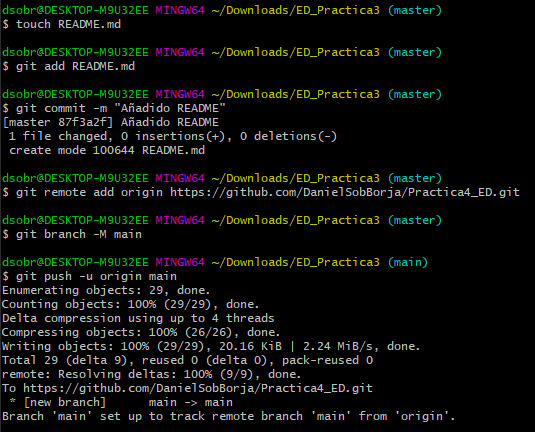
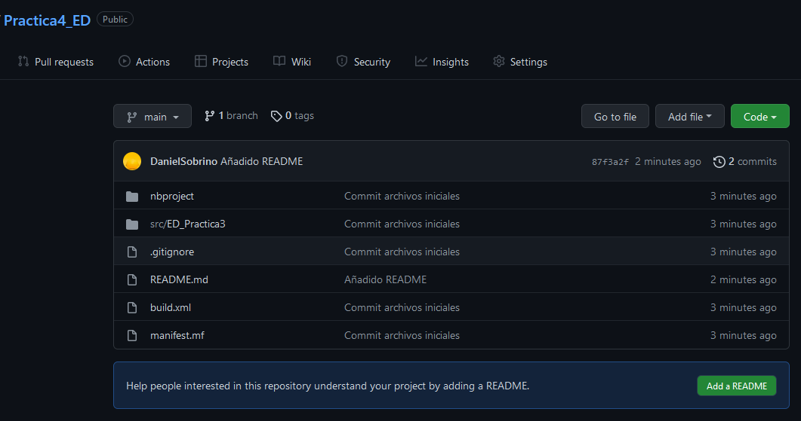

Ahora creo la rama pruebas, donde realizaré algunas refactorizaciones de mi código.


Mediante el ```git log``` puedo ver los registros de los distintos commits. Para tener un mejor control de versiones, le añado el versionado semántico haciendo uso de las tags. Subo las tags al repositorio con el comando ```git push --tags```.
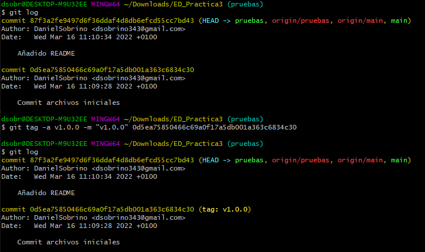
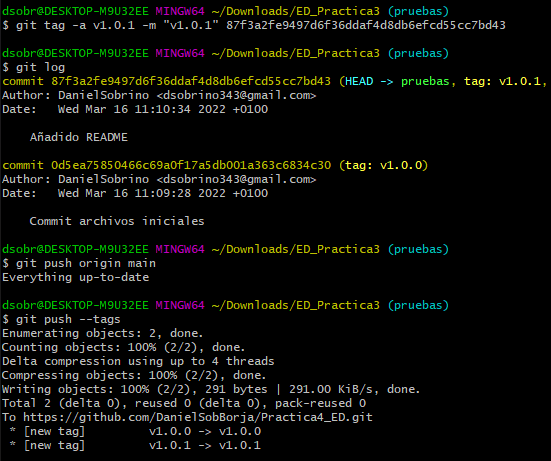
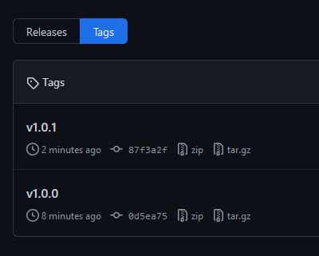

#### Refactorizaciones
Es momento de comenzar a hacer refactorizaciones del código, usando la rama pruebas que hemos creado anteriormente, para así hacer ```merge``` con la rama main una vez estoy contento con los cambios.
Los cambios que realizaré son:
- Renombrar clase Persona a clase Humano
- Arreglar errores por uso de la letra ñ en ```Niño.class```.

Después de cada refactorización usaré ```git status``` para ver las modificaciones, y ```git commit -am ""``` para añadir y registrar estos cambios.
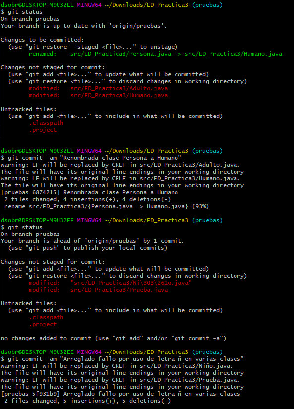

Como todo parece haber ido bien, me muevo a la rama main para posteriormente fusionarle la rama de pruebas donde he realizado las refactorizaciones.
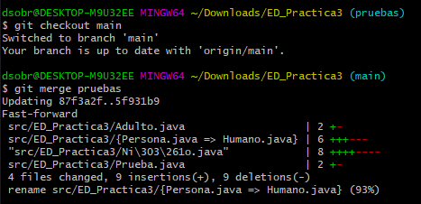

A cada commit le asignaré una tag mediante la misma metodología vista anteriormente. Este es el resultado final:
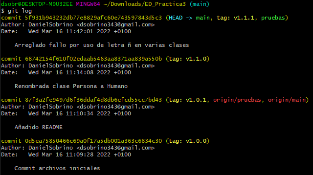

En un momento dado he vuelto a llamar v1.0.0 a una tag por error, y al eliminarla se han eliminado ambas, la primera tag, y la nueva. Por desconocimiento he vuelto a añadirla, lo que ha causado el error que se ve a continuación al hacer el push, pero no ha dado más problemas.
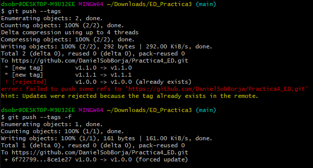

Para la última refactorización creo otra rama, llamada "otra", me desplazo a esta y la subo.
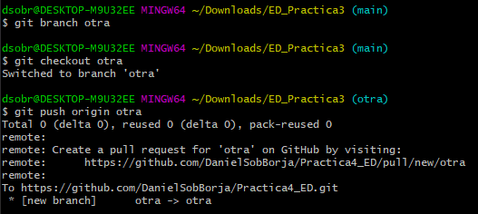
La refactorización consiste en:
1. Elimiar la interfaz sonido.
2. Borrar las distintas implementaciones de esta.
3. Comentar los métodos que hacían uso de la interfaz.
4. Comentar las distintas llamadas a esos métodos.

Después de hacer commit de la refactorización, me muevo a la main y hago merge con la rama donde he realizado los cambios.
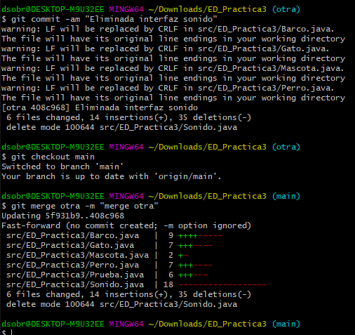

Añado las tags que falten y subo los cambios a github.
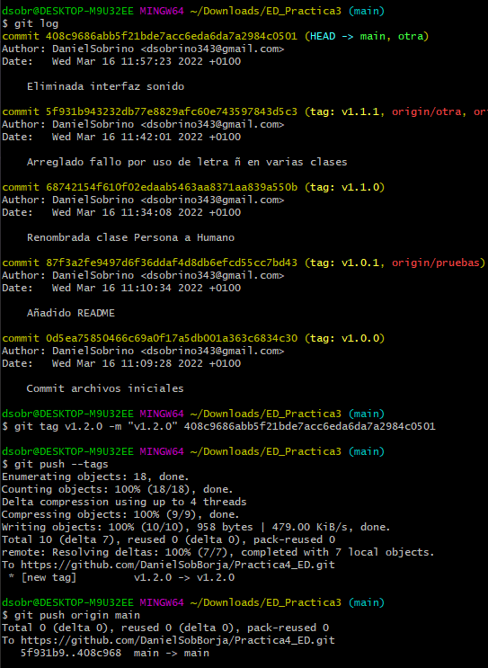
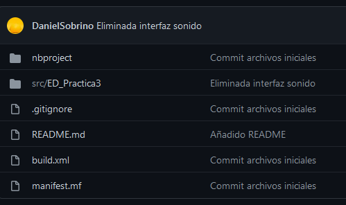

Aquí se puede ver una comparación de los distintos commits con sus respectivos tags, en terminal e interfaz de github.
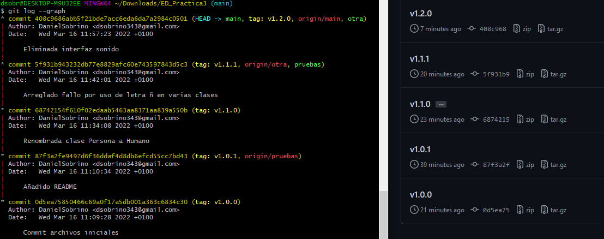
